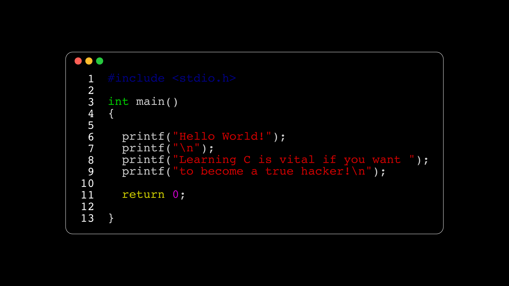

# Table of Contents

1.  [Comment créerun site web et l'héberger gratuitement ?](#orge2fb386)
    1.  [Créer un compte GitHub](#orga1a1af6)
    2.  [Créer un dépôt (create new repository)](#orgab74f39)
2.  [Un peu de mathématiques ?](#org78b2b75)
    1.  [Mon kit GRATUIT pour les probabilités discrètes](#org6f5800e)
    2.  [Triangle de Sierpinski](#orgfd40716)
    3.  [Mon kit GRATUIT pour la théorie des groupes](#orgca55db9)
3.  [Apprendre le code oui, mais par où commencer ?](#org0cce975)
    1.  [Le C c'est pour les vrais](#org165eb11)
    2.  [Apprenez Python en moins de 5 heures](#orge13d0bc)

# Comment créerun site web et l'héberger gratuitement ?

## Créer un compte GitHub

Pour créer un compte GitHub il suffit d'aller sur le site
github.com et vous pouvez même utiliser votre compte Google pour
vous inscrire.

## Créer un dépôt (create new repository)

Attention à cette étape vous devez donner un nom spécifique du
style : `nom.github.io`

# Un peu de mathématiques ?

## Mon kit GRATUIT pour les probabilités discrètes

Voici mon kit GRATUIT pour les probabilités discrètes :
<https://laurentgarnier.podia.com/kit-de-survie-probas-discretes>

## Triangle de Sierpinski

<https://sierpinski-triangle.polymathfreeman.repl.co>

## Mon kit GRATUIT pour la théorie des groupes

Découvrez la théorie des groupes :

-   en vidéos :
    <https://www.youtube.com/watch?v=hFa5eo6FT0U&list=PLwWStLtwGECZ1YPIBHzCD3-rzFjCPWnXO>
-   en pdf : <https://laurentgarnier.podia.com/theorie-des-groupes>

# Apprendre le code oui, mais par où commencer ?

## Le C c'est pour les vrais

Suivez mon cours pour apprendre le C :

<https://laurentgarnier.podia.com/ressourc-vous-avec-le-langage-c>

## Apprenez Python en moins de 5 heures

Pour 5 petits euros, vous pouvez obtenir mon livre :

[Apprenez Python en moins de 5 heures](https://www.amazon.fr/Apprenez-Python-heures-Laurent-Garnier-ebook/dp/B0B3THJPP2/ref=sr_1_2?__mk_fr_FR=%C3%85M%C3%85%C5%BD%C3%95%C3%91&crid=2RMKTEQK6MRNA&keywords=apprenez+Python+en+moins+de+5+heures&qid=1657290940&sprefix=apprenez+python+en+moins+de+5+heu%2Caps%2C3104&sr=8-2)

